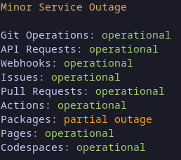

# GitHub Status


A simple Cli to check the status of GitHub

## Install

Clone and install the repositry

```sh
git clone git@github.com/sanders41/github-status
cd github-status
cargo install --path .
```

This will install to the `~/.cargo/bin` directory


## Usage

To see a list of available commands run:

```sh
github-status --help
```

## Example

```sh
github-status summary
```


